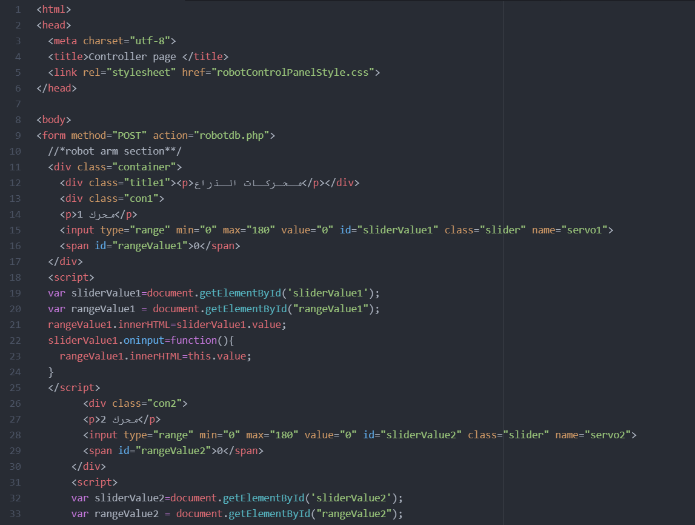

# Rofida Chatbot
This repository is about a chatbot.

 ## Description 

This project is a chatbot called Rofida who works as an assistant.

There are four pages in this repository and two databases

#### 1. robotConntrolPanel.html:
 
This page includes the code for HTML, there are 3 sections in the code 1- to control the arm, 2- is to control the base of the robot and 3- is to add chatbot to the website page.

* The robot arm section:

There are 6 servos to control the arm of the robot that's why there are 6 range sliders, each slider has values that range between 0 and 180, also there are two buttons one for saving the values from the range sliders to the database at MySQL and the other is to display the values in separate page.

* The robot base section:

There are 5 buttons each button moves the base in a specific direction and the direction is saved to the database.

* chatbot section:

#### 2. robotControlPanelStyle.css:

This page include the design of the elements on the html page like the background, fonts and the layout style.

#### 3. robotdb.php:

This page connects the values of the servos and the directions of the base to the databases.

#### 4. skill-تحدث.json

This is the json file that contains the property of the chatbot

#### 5. robotcontroller.sql:

This is the robot arm database file.

#### 6. robotbase.sql:

This is the robot base database file.

